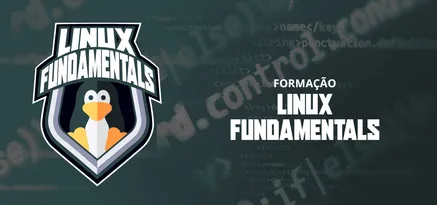

### FORMAÇÃO LINUX FUNDAMENTALS

Repositório para estudo dos conceitos aprendidos durante o curso **Formação Linux Fundamentals**, oferecido pela plataforma de ensino **Digital Innovation One - DIO**.

### Links
[Digital Innovation One](https://www.dio.me) 
[Formação Linux Fundamentals](https://www.dio.me/curso-linux) 
[Linux Foundation](https://www.linuxfoundation.org/)

### Ferramentas

### Conceitos Desenvolvidos

- **Introdução ao Sistema Operacional Linux**
    - **Conceitos de Sistema Operacional**
        - kernel
            - faz a ponte entre o usuário e o hardware
            - não possui ambiente gráfico
        - Sistemas Operacionais Domésticos
            - Linux, Microsoft Windows, Mac OS
        - Sistemas Operacionais Servidores
    - **Linux**
        - muito utilizado no segmento de **servidores** e por **desenvolvedores**
        - desenvolvido por **Linus Torvalds**
        - inspirado no **Unix**
        - mantido por uma comunidade internacional **Linux Foundation** e distribuido gratuitamente
        - utiliza ambiente gráfico ou terminal para acessar o kernel
        - Linux possui diversos ambientes gráficos e podem ser trocados (Gnome, KDE Plasma, etc)
        - **Distribuições**
            - consiste em um kernel Linux com aplicativos especificos e são mantidos por empresas ou comunidades
            - Principais distribuições:
                Debian, Ubuntu, Red Hat, Fedora, Suse, etc
        - **Sistemas Embarcados**
            - Android, Raspberry Pi
            - Televisões, smartwatches, etc
        - **Modelo Cliente-Servidor**
            - Servidor: fornece um recurso ou serviço (ex.: site, banco de dados) através de um Sistema Operacional de Servidor
            - Cliente: quem solicita o serviço através de um Sistema Operacional Desktop
    - **Máquinas virtuais**
        - Instalação do **Ubuntu Server** na máquina virtual

- **Acesso Remoto a Máquinas Linux**
    - Como obter o ip da máquina
    > Terminal: `ip a`
    - Como acessar a máquina virtual remotamente através de um Linux
    > Terminal: `ssh nome-do-usuario-maquina-virtual@ip-da-maquina-virtual`

- **Comandos Iniciais**
    - `reboot`
    - `date`
    - `clear` ou  teclas: `Ctrl` + `l`
    - `systemctl poweroff`
- **Trabalhando com Arquivos**

    - **Navegação de Diretórios**
        - `pwd`: informa o diretorio atual
        - `cd /`: acessa o diretório raiz
        - `cd ~`: acessa o diretório do usuário
        - `ls`: lista diretorios e arquivos contidos no diretorio atual 
        - `cd nome_diretorio`: avança para o diretorio "nome_diretorio" a partir do diretório atual
        - `cd nome_diretorio/nome_diretorio`: avança dois diretorios a partir do diretorio atual
        - `cd ..`: volta para o diretorio anterior
        - `cd ../..`: volta dois diretórios
        - **Dica**: quando estiver utilizando o comando "cd", o uso do `tab` completa o nome do diretório seguinte ou lista os possíveis diretórios acessíveis
 
    - **Filtrar a exibição de arquivos**

        - `ls | more`: apresenta os arquivos/diretórios em lista vertical e utilizar `enter` para selecionar o próximo da lista (útil quando o diretório possui muitos arquivos/diretórios e não possui barra de rolagem)
        - `ls nome_do_diretório/arquivo`: informa se a pasta atual possui o nome_do_diretório/arquivo
        - `ls *`: lista os diretórios com seus respectivos arquivos
        - `ls a*`: lista os diretórios iniciados com a letra a e os diretorios iniciados com a letra a com seus respectivos arquivos
        - listar arquivos com sequencia numerica:
            - exemplo `ls nome-do-arquivo[1-5]*` ou `ls nome-do-arquivo[1,3,5]*`
            - exemplo `ls nome-do-arquivo[^1,5]*` : lista todos menos o 1 e o 5
    
    - **Criar um arquivo**
        - `touch nome-do-arquivo.extensão`: criar o arquivo dentro da pasta atual
            - exemplo: `touch teste.txt`

    - **Busca de arquivos**

        - **ls**
            - `ls /nome-da-pasta/nome-arquivo` 
        Buscar um nome parcial
            - `ls /nome-da-pasta/arquivo*` 
        
        - **find**
            - `find -name "nome-do-arquivo"`
            - `find -name "nome-do-arquivo*"`

    - **Criar diretórios**
        
        - Na pasta aberta no terminal
            - `mkdir novo-diretório`
            - `mkdir "novo diretorio"`
        - Criar multiplos diretórios
            - `mkdir novo-diretorio1 novo-diretorio2`
        - Em pasta diferente do terminal
            - `mkdir /home/diretorio/novo-diretorio`
            - `mkdir /home/diretorio/diretorio/novo-diretorio`

    - **Remover diretórios**

        - Na pasta em que o diretório se localiza
            - `rmdir nome-do-diretorio`
            - `rmdir "nome do diretorio"`
        - Remover multiplos diretorios
            - `rmdir diretorio1 diretorio2`

    - **Remover arquivos**

        - Na pasta que o arquivo se localiza
            - `rm nome-do-arquivo`
        - Remover todos com mesma extensão
            - `rm *.extensão`
        - Remover vários arquivos com nomes similares
            - `rm arquivo*`

    - **Edição de Arquivos**
        - Editores
            - vi
                - `vi nome-do-arquivo`
                - Para editar o arquivo: `i`
                - Para sair do modo de edição: teclar `Esc`
                - Para habilitar o menu do vi: teclar `:`
                - Para salvar o arquivo: `w`
                - Para sair do editor vi: `q`
            - nano
                - `nano nome-do-arquivo`: O nano já entra em modo de edição.
                - Para salvar: `Ctrl + o` e `Enter`
                - Para sair: `Ctrl + x`

- Comando history
    - Para ver o comandos realizados no terminal
        - `history`
    - Para ver uma quantidade específica dos ultimos comandos:
        - `history 30`
        - `history 5`
    - Para executar um comando a partir da listagem do history
        - `!numero-do-comando-na-lista-do-history`
        - Exemplo: `!50`
    - Para executar o último comando digitado no terminal
        - `!!`
    - Para executar o último comando a partir de um parâmetro
        - `!?parametro?`
        - Exemplo: `!?teste?`: Neste comando será executado o último comando do history que contêm o termo "teste"
    - Para listar todos os comandos do history a partir de um parâmetro
        - `history | grep "parametro"`
        - Exemplo: `history | grep "install"`
    - Para exibir o history com data e hora dos comando
        - `export HISTTIMEFORMAT="%c "`
        - `history`

